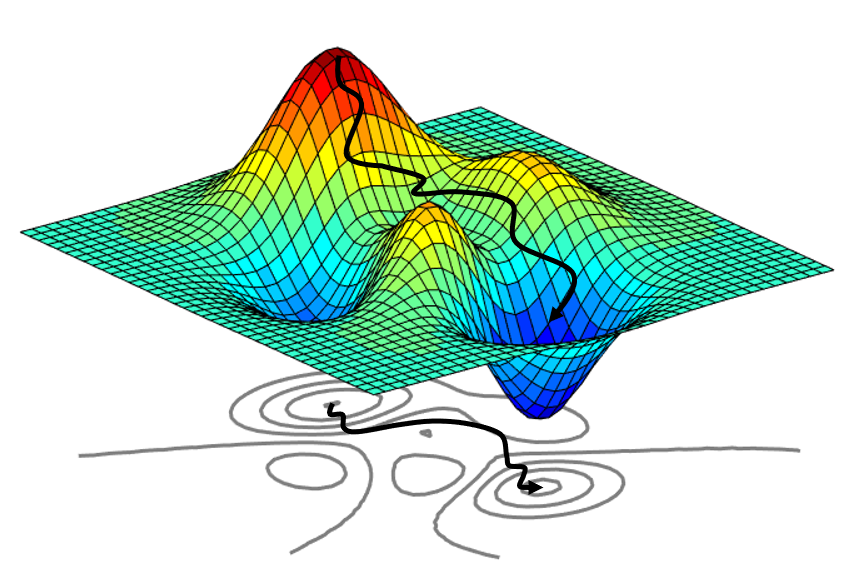

# Hessian Network Learning (PyTorch)
## Abstract
Hessian matrix is a square matrix of second-order partial derivative of a scalar-valued function. In the context of neural networks and deep learning, this function typically represents the loss or object function, which the training process aims to minimize. The Hessian Matrix, thus describes the curvature of the loss function surface.

When the parameters of a model are organized in a matrix form of *m* x *n*, we vectorize this matrix to convert it into a vector of *mn* elements. For a function *f* that has this vector as input, the Hessian matrix of *f* will have a size of *mn* x *mn* matrix. Each element in the Hessian matrix, H[*i*, *j*], is the second derivative of the function with with respect to two of its variables.
<p align="center">
  
</p>

## Background
When we use the common gradient descent method, we are generally assuming that the loss surface of the network behaves like a plane, disregarding any curvature. This assumption often results in slower training speeds. To address this, we can use the information from the second derivative of a function, as it uses curvature information to improve search direction and make more progress per step. The fundamental approach for second-order minimazation is Newton's method.
<p align="center">
  
</p>

Now, let's delve into the derivation of this optimization formula, beginning with a Taylor series. As you know, if a real-valued function *f(x)* is differentiable at the point x = a, it can be represented by a power series expansion around this point. For our purposes, let's approximate the function *f* using a second-order Taylor expansion at x<sub>0</sub>. Subsequently, we aim to differentiate *f(x + x<sub>0</sub>)* to locate its minimum. This process leads us to the following derivation.
<p align="center">
  
</p>
<p align="center">
  
</p>
<p align="center">
  
</p>
<p align="center">
  
</p>
In Newton's method, we usually don't use learning rate because Hessian metrix already adjusts the step size based on the curvature of the loss surface at current point.

## Merits of Using Hessian in Network Learning
* The Hessian matrix provides critical insights into the geometry of the loss surface, thereby informing us about the curvature of the graph. It enables the optimizer to adjust its steps based on this curvature: in regions where the curvature is steep, the optimizer takes smaller steps to prevent overshooting the minimum; conversely, in flatter regions, it can afford to take larger steps.
* When training neural networks, there are often many saddle points, which are places where the gradient is zero but are not the lowest points. The Hessian matrix helps idenity and avoid these saddle points because it is netiher clearly positive nor clearly negative at these locations.
<p align="center">
  
</p>

## Example Codes 
In these example codes, we configured a dummy model parameter and a target parameter, each with a batch size and feature dimension of 5. The parameters are updated across 40 iterations using a learning rate of 0.1. The criterion applied in this experiment is the Mean Squared Error(MSE) loss. For optimizing the network using Hessian matrix, we purposely included a fixed learning rate in order to demonstrate the convergence speed across all experiemnts.

### Conventional Gradient Descent (1st Order Partial Derivative)
```py
# Create Seed
torch.manual_seed(0)

# Create a dummy model parameter and target parameter with batch and feature of 5
params = torch.rand(5,5, requires_grad=True)
target = torch.rand(5,5)
print("Initial Parameters:\n", params)
print("Target Parameters:\n", target, "\n")

# Train configurations
epoch = 40
lr = 0.1
criterion = nn.MSELoss(reduction='mean')

# Compute first order gradient (a' = a - lr*grad)
loss_1 = []
print("Start Training!")
for i in range(epoch):
    loss = criterion(params, target)
    loss_1.append(loss.item())

    params.retain_grad()
    loss.backward(create_graph=True)
    
    params = params - (lr*params.grad)
    
    if i % 10 == 0:
        print(f"Epoch {i} | Loss: {loss.item():.4f}")
```

### Hessian Optimization (2nd Order Partial Derivative)
```py
# Create Seed
torch.manual_seed(0)

# Create a dummy model parameters and target parameters
params = torch.rand(5,5, requires_grad=True)
target = torch.rand(5,5)
print("Initial Parameters:\n", params)
print("Target Parameters:\n", target, "\n")

# Train configurations
epoch = 40
lr = 0.1
criterion = nn.MSELoss(reduction='mean')

# Compute second order gradient (a' = a - lr*inv(H)*grad)
loss_2 = []
hessian_matrix = torch.zeros(5*5, 5*5, dtype=torch.float32)
print("Start Training!")
for i in range(epoch):
    loss = criterion(params, target)
    loss_2.append(loss.item())
    params.retain_grad()
    loss.backward(create_graph=True)
    grad = params.grad.flatten()

    # Compute Hessian for each parameter
    for j in range(len(grad)): 
        grad_2nd = torch.autograd.grad(grad[j], params, create_graph=True)[0]
        hessian_matrix[j] = grad_2nd.flatten()
        
    params = params.view(-1) - lr*(torch.inverse(hessian_matrix) @ grad)
    params = params.view(5,5)
    
    if i % 10 == 0:
        print(f"Epoch {i} | Loss: {loss.item():.4f}")
```

### Hessian Optimization (2nd Order Partial Derivative - PyTorch)
```py
# Create Seed
torch.manual_seed(0)

# Create a dummy model parameters and target parameters
params = torch.rand(5,5, requires_grad=True)
target = torch.rand(5,5)
print("Initial Parameters:\n", params)
print("Target Parameters:\n", target, "\n")

# Train configurations
epoch = 40
lr = 0.1
criterion = nn.MSELoss(reduction='mean')

# Compute second order gradient (a' = a - lr*inv(H)*grad)
def compute_loss(params, target):
    loss = criterion(params, target)
    return loss

loss_3 = []
print("Start Training!")
for i in range(epoch):
    loss = criterion(params, target)
    params.retain_grad()
    loss.backward(create_graph=True)
    loss_3.append(loss.item())
    grad = params.grad.flatten()
    
    hessian_matrix = AF.hessian(compute_loss, (params, target))[0][0].view(25,25)
    params = params.view(-1) - lr*(torch.inverse(hessian_matrix) @ grad)
    params = params.view(5,5)
    
    if i % 10 == 0:
        print(f"Epoch {i} | Loss: {loss.item():.4f}")
```

## Graph Comparison & Relative Percentage Improvement
<p align="center">
  
</p>

| Method | Initial Loss <br> (Epoch 0) | Final Loss <br> (Epoch 40) | Relative Percentage Improvement |
| ----- | --------- | --------- | --------- |
| 1st Order Partial Derivative (Manual) | 0.1446 | 0.0893 | 38.2% |
| 2nd Order Partial Derivative (Manual / PyTorch) | 0.1446 | 0.0003 | 99.8% |
